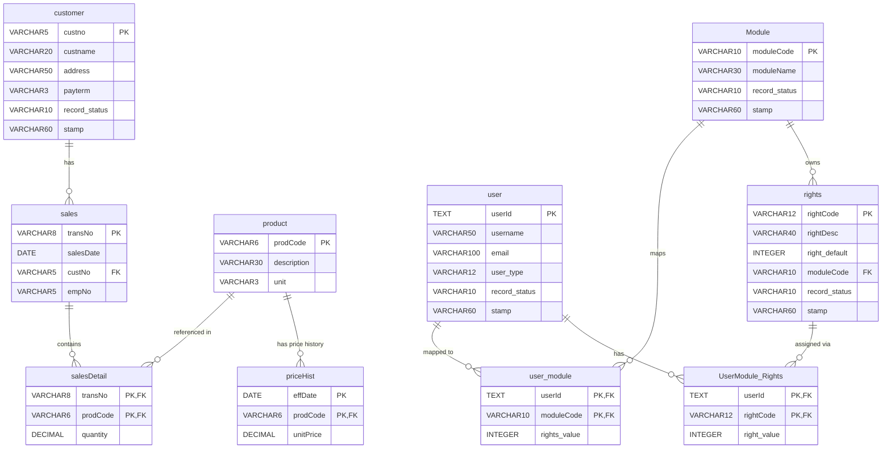

# HopeCMS — Database ERD

**PR-03: docs/db-erd**
Branch: `docs/db-erd` | Engineer: M3

---

## Notes

- `record_status` and `stamp` exist **only** on `customer` and `user`. All other core tables (`sales`, `salesDetail`, `product`, `priceHist`) are structurally unchanged from HopeDB.
- `salesDetail` and `priceHist` use **composite primary keys** (`PK-FK`).
- `user_module` and `UserModule_Rights` are pure **junction tables** with composite PKs.
- `empNo` on `sales` is stored as plain `VARCHAR` — the `employee` table is outside the scope of this Supabase project and no FK is enforced.
- The current price of any product is always `MAX(effDate)` per `prodCode` in `priceHist` — see the `product_current_price` view (Sprint 2, PR-03).

---

